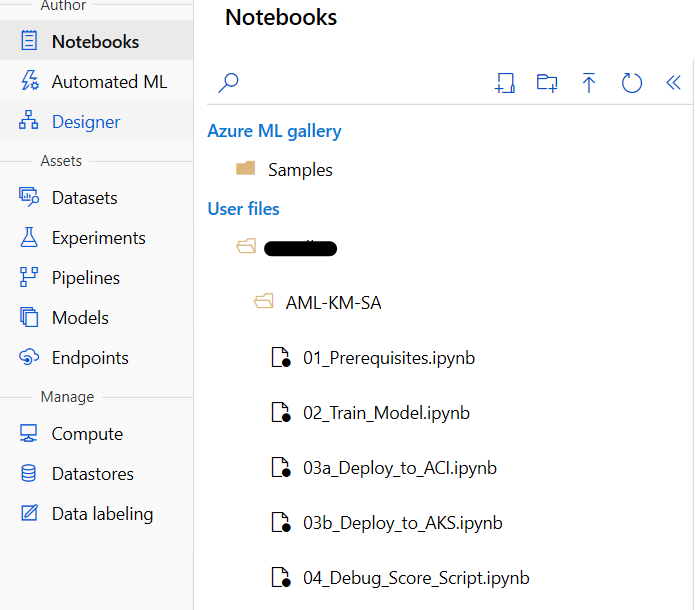

# 1.0 Train and Deploy the Model

## Prerequisites

Before you can run these notebooks, you'll need to set up your [compute environment](https://docs.microsoft.com/en-us/azure/machine-learning/how-to-configure-environment#compute-instance) for Azure Machine Learning. The easiest way to get up and running is to use a [cloud based compute instance](https://docs.microsoft.com/en-us/azure/machine-learning/concept-compute-instance).

Note: Compute instances are replacing the Notebook VM. In regions where compute instances are not available yet, you can continue to use Notebook VMs with full functionality and create new Notebook VMs. 

## Getting Started

If you are going to use Azure ML Compute Instance or Notebook VM, download the notebooks from the 01_Train_and_Deploy folder to a folder in "User Files as shown below.

Run through each the Jupyter notebooks in order to train and deploy the BERT NER model:
These notebooks demonstrate how to fine tune pretrained Transformer model for named entity recognition (NER) task. The model is based on this [amazing example](https://github.com/microsoft/nlp-recipes/tree/master/examples/named_entity_recognition). The pretrained transformer of BERT (Bidirectional Transformers for Language Understanding) architecture is used in this example.

### 01 - Prerequisites

Configures your workspace and walks through the process of downloading the data.

### 02 - Train Model

Trains the BERT model. Optionally, you can run HyperParameter Tuning for the model.

### 03 - Deploy to AKS

Deploys the model to an HTTPS endpoint on Azure Kubernetes Service.

### 04 - Debug Scoring Script (*Optional*)

An optional notebook to test and debug a scoring script. We've found this technique is the easiest way to debug a scoring script.

## Model

By default, the ML model trained extracts two entity types: products and features. In the scoring script we return both of these entity types.

If you choose to update the entities extracted by your model, you can update the Scoring script to return other entities.
